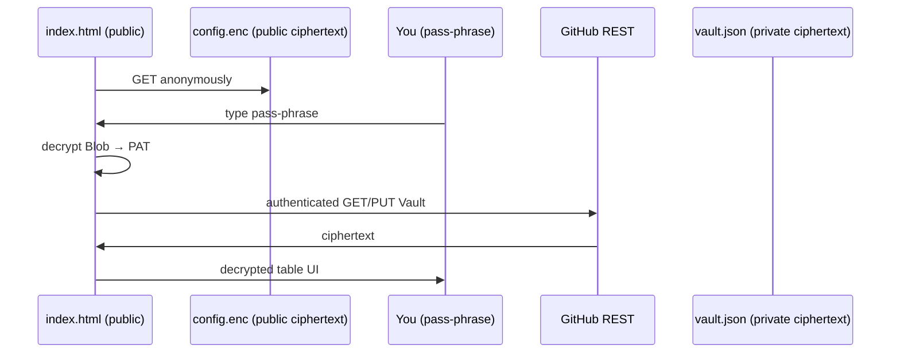

# Secretos — Browser‑Only Password Vault

A **server‑free** password manager built from two GitHub repositories and your browser’s Web Crypto API. Nothing runs on a backend; nothing leaves your browser unencrypted.

| Repository                 | Visibility  | Purpose                                                                                           |
| -------------------------- | ----------- | ------------------------------------------------------------------------------------------------- |
| **`secretos`** (this repo) | **Public**  | Hosts the static site (`index.html`, `make-config.html`) **plus one encrypted file `config.enc`** |
| **`vault`**                | **Private** | Holds a single encrypted file `vault.json` that contains all of your secrets                      |

Only two things ever move across the network:

* **Cipher‑text** (`config.enc`, `vault.json`)
* **GitHub API calls** signed with your Personal‑Access‑Token (PAT)

Your pass‑phrase never leaves your browser.

---

## How it works — 30 second view

* **config.enc** encrypts your PAT with AES‑256‑GCM using a key derived from your pass‑phrase (PBKDF2, 250k rounds, random salt).
* Each time you save, the entire vault array is re‑encrypted with a fresh random IV; commits are versioned automatically by Git.

---

## One‑time set‑up (≈ 5 minutes)

> You will paste your token **only into pages served from your own GitHub domain**, never into a third‑party site.

\### 1  Fork and publish **`secretos`**

1. Click **Fork** (top‑right) → *your account*.
2. Repo ▸ **Settings ▸ Pages** → Source: `main` / root → **Save**.
   Pages will deploy to **`https://<username>.github.io/secretos/`** within a minute.

\### 2  Create **`vault`**

*New repository* → Name **`vault`** → **Private** → Create (leave it empty).

\### 3  Generate a fine‑grained PAT (once)

1. **Settings ▸ Developer settings ▸ Personal access tokens ▸ Fine‑grained ▸ Generate**
2. **Repository access** → select **`secretos`** & **`vault`**
3. **Repository permissions** → **Contents → Read & Write**
4. Save → copy token (`github_pat_***`).

\### 4  Encrypt and store the token

1. Open **`https://<username>.github.io/secretos/make-config.html`**
2. Fill in:

   * **Pass‑phrase** – choose something long and random (≥ 80‑bit entropy)
   * **PAT** – paste the token you just created
3. Click **Generate & Commit ↗︎**. The wizard:

   1. Encrypts the PAT into **`config.enc`**
   2. Commits/updates that file at the root of **`secretos`** via the GitHub API
4. Success toast ➜ open the provided **Vault** link.

\### 5  Log in

Visit **`https://<username>.github.io/secretos/`**, enter your pass‑phrase, and start adding secrets.

---

## Everyday use

* **Filter** by typing above the table.
* **＋ Add** to insert a new pair; click any row to edit.
* **Save** commits a new encrypted blob to `vault.json`.
* GitHub keeps full history, so you can revert or audit.

---

## Rotate the token / pass‑phrase

1. Create a new fine‑grained token (same scopes).
2. Re‑run your hosted **make-config.html** with the new token + (new) pass‑phrase.
3. Click **Generate & Commit** → `config.enc` is replaced in one commit.
4. Revoke the old token in GitHub settings.

---

## Security FAQ

| Question                                        | Answer                                                                                            |
| ----------------------------------------------- | ------------------------------------------------------------------------------------------------- |
| **Is `config.enc` safe in a public repo?**      | Yes – it’s AES‑256‑GCM cipher‑text; without your pass‑phrase it’s useless.                        |
| **What if someone also steals `vault.json`?**   | They still need the pass‑phrase. Use high entropy.                                                |
| **What can the PAT do?**                        | Only read/write **contents** of `secretos` and `vault`. It cannot access other repos or settings. |
| **Does my pass‑phrase ever leave the browser?** | Never. All crypto runs client‑side.                                                               |

---

## Troubleshooting

| Symptom                 | Fix                                                                                   |
| ----------------------- | ------------------------------------------------------------------------------------- |
| **404 on `config.enc`** | Ensure the file exists at repo root (`main` branch) and Pages has finished deploying. |
| **“Bad pass‑phrase”**   | Decryption failed – check spelling/capitalisation. There is no recovery if forgotten. |
| **GitHub API 403**      | PAT lacks `Contents RW` on `vault`, PAT revoked, or SSO not authorised.               |

---

## Advanced

* **Offline backup** – download `vault.json` from `vault` and archive it.
* **Multiple vaults** – duplicate this repo; generate separate PATs & pass‑phrases per vault.
* **Manual set‑up** – run `make-config.html` from `file:///…` and commit `config.enc` via Git.

---

## License

MIT. Contributions welcome.
